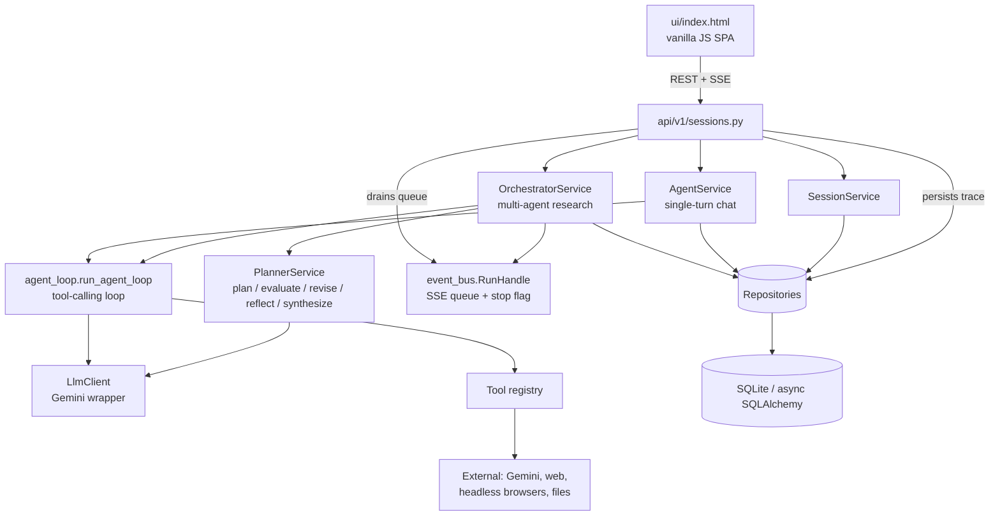

# REPO_MAP

> Long-term memory for humans and AI assistants. High-level architecture only —
> no implementation detail. Update this when architecture, major features,
> component responsibilities, folder layout, or cross-component interactions
> change. Do **not** update for bug fixes, renames, formatting, or small refactors.

---

# Project Overview

An **agentic research harness** — a Claude-Code-style backend that answers
research questions by planning, running tools, and self-correcting in a loop,
rather than replying in a single shot.

**Primary goals**

- Take a question (optionally with uploaded files/images) and produce a
  well-sourced, Markdown-formatted answer.
- Decompose work into a plan, run steps as parallel sub-agents with real tools
  (web search, crawl, browser automation, document parsing, code/shell exec),
  and keep going — replanning and self-reflecting — until the answer is
  genuinely sufficient ("never take no for an answer").
- Be dynamic and robust: per-model context/thinking selection, timeouts,
  circuit breaking, caching, context compaction, and a persisted activity trace.
- Stream progress and the final answer to a minimal web UI, with multi-session
  chat history and continuity.

---

# Repository Structure

| Path | Purpose | Key responsibilities |
| --- | --- | --- |
| `main.py` | Entrypoint | `create_app()` factory, exception handlers, static UI mount, uvicorn runner |
| `app/api/v1/` | HTTP routers | `sessions.py` (all session/chat/research/upload/export routes), `health.py`, `router.py` (aggregator) |
| `app/core/` | Cross-cutting config | `config.py` (pydantic-settings), `models.py` (model + thinking-level catalogue), `logging.py` (JSON, level-aware filter), `exceptions.py` |
| `app/db/` | Database plumbing | Async engine/session factory, `Base`, `init_db()` + lightweight additive migrations |
| `app/models/` | SQLAlchemy ORM models | `agent_session`, `message`, `plan_node`, `artifact`, `ledger_entry`, `run_event` |
| `app/repositories/` | DB access | One repo per aggregate; all ORM queries live here |
| `app/schemas/` | Pydantic DTOs | Request/response models; some double as Gemini structured-output schemas |
| `app/services/` | Business logic / orchestration | Planner, orchestrator, agent loop, single-agent chat, LLM client, event bus, session use-cases |
| `app/tools/` | Agent tools + registry | Search, fetch/parse, retrieval, code/shell exec, browser automation, image analysis, plus per-session guard/cache and a shared browser-session factory |
| `app/retrieval/` | Reasoning retrieval | PageIndex-style section-tree builder for long documents |
| `utils/` | Pure helpers | `response.py` (standard API envelope), `geo.py` (country → locale/timezone/geo context), etc. |
| `tests/` | pytest + httpx | Offline tests with fake LLM via `app.dependency_overrides` |
| `ui/` | Frontend | Single-file `index.html` (vanilla JS): sessions, streaming, uploads, export, Markdown/Mermaid render; right panel is a tabbed view (Plan / Activity / Files) with per-turn plan groups and downloadable files |
| `docs/` | Design docs | `idea.md` (original brief), `implementation-plan.md` (phased plan) |
| `.github/` | Governance | `copilot-instructions.md` (engineering guide), this `REPO_MAP.md` |

> `app/` uses **namespace packages** (no `__init__.py`); run mypy with
> `--explicit-package-bases`. Model modules are imported explicitly in
> `init_db()` so they register on `Base.metadata`.

---

# Architecture

Layered FastAPI service. Routes parse input and call services; services own
business logic and call repositories; repositories own all DB access.

**Component responsibilities**

- **API layer (`api/v1/sessions.py`)** — the only HTTP surface. Creates/lists/
  deletes sessions, chat, research (+ SSE stream), revise (+ stream), stop, plan
  (all turns), events, messages, artifacts (list + raw-file download), file
  upload, model options, settings, export data. Owns the SSE choke point that
  streams events **and persists them** as the activity trace.
- **OrchestratorService** — the research control loop. Builds a plan, schedules
  ready nodes as parallel sub-agents over a NetworkX DAG, evaluates/replans,
  and streams a synthesized answer. Owns turns, budgets, stop, no-progress guard.
- **PlannerService** — pure LLM reasoning via Gemini structured output:
  `create_plan`, `evaluate`, `revise`, `reflect` (sub-agent self-critique),
  `synthesize` / `synthesize_stream`.
- **agent_loop** — the reusable tool-calling loop used by both sub-agents and
  single-agent chat. Handles tool dispatch, timeouts, circuit breaking, result
  caching, and progressive context compaction.
- **AgentService** — one-shot chat turn (no planning), for direct Q&A.
- **LlmClient** — thin async Gemini wrapper: model + thinking level selection,
  structured output, streaming, vision, grounded search, retry/backoff, per-model
  output cap. Stamps **every** system prompt (planner, evaluator, reviser,
  reflection, synthesis, tool loop) with the current date/time so all reasoning
  shares a live "now".
- **event_bus** — in-memory per-run `RunHandle` (SSE queue + stop flag) and a
  registry so `/stop` can signal an active run.
- **Repositories / models / db** — async SQLAlchemy persistence.

---

# Feature Map

| Feature | How it works |
| --- | --- |
| **Multi-agent research** | Planner decomposes → orchestrator runs ready DAG nodes as parallel sub-agents → evaluator reshapes the plan (add/drop/reorder/insert) → answer synthesized and streamed. |
| **Dynamic plan reshaping** | The evaluator can not only append steps but drop pending ones (`remove_step_numbers`) and inject dependency edges into pending steps (`new_dependencies`) to reorder or insert a prerequisite mid-run. Orchestrator `_apply_plan_delta` retires dropped nodes and strips dangling edges so the DAG can't deadlock. |
| **Recursive sub-agent fan-out** | Any agent can call the `spawn_subagents` tool to split its task into N independent child agents run in parallel (each with the full tool set), bounded by `max_subagent_depth` / `max_spawn_fanout`. Lets decomposition happen at run time, not just in the top-level plan. |
| **Tool use** | Sub-agents call tools via manual function-calling; the registry exposes ~12 tools (see Concepts). |
| **Source-chasing extraction** | When a source references another document not yet held, the agent follows the reference instead of stopping at the pointer. `crawl_url` returns clean markdown to read PLUS a structured link map (absolute hrefs, internal/external) and a raw-HTML artifact; the agent crawls/downloads the linked source, `read_artifact`s the HTML for onclick/embedded targets the markdown dropped, or drives `browser_use` for JS interaction. The evaluator/reflect prompts treat "only a pointer, source not fetched" as **not done**, so the existing plan-reshaping and gather-more loops iterate until the primary source is in hand. |
| **Sub-agent self-reflection** | After each pass, a sub-agent critiques its own result ("sufficient, or gather more?") and loops until sufficient or a cap. |
| **Dynamic robustness** | Per-tool timeouts, per-session circuit breaker for flaky tools, in-session result cache, no-progress guard, refusal detection. |
| **File / image Q&A** | Uploads become session artifacts; agents `parse_document` → `bm25_search` / `doc_navigate` (PageIndex); images are auto-described via Gemini vision. |
| **Model & thinking selection** | Per-session choice of model + thinking level (low/medium/high) from a central catalogue; drives context window and output caps. |
| **Country/locale context** | The visitor's country is resolved per request: the UI detects it from `navigator.language` and sends `X-User-Country`; a router dependency stores it in a context var (`app/core/request_context.py`) that overrides the `USER_COUNTRY` env default. Resolved via `utils/geo.py`, it is injected into every agent prompt alongside the date/day and pins the scraping browser's locale, timezone, capital geolocation, and `Accept-Language` header so crawls present the user's region. Empty = no bias (date-only prompts, randomized browser locale). |
| **Context management** | Large excerpts/history fed generously; loop context compacted (summarized) when it exceeds a model-derived threshold. |
| **Streaming + stop + revise** | SSE streams plan/tool/reflection/answer events; runs can be stopped mid-flight; a stopped run can be revised with a new instruction, reusing prior results. |
| **Session continuity** | Prior conversation + artifacts are fed into new turns; each query is a new "turn" with its own plan scoped by turn number. |
| **Plan traceability** | `/plan` returns every turn's nodes (not just the latest); the UI groups them per turn ("Chat N") and step results stream un-truncated. |
| **Activity trace** | Every meaningful event is persisted (`run_events`) so the trace replays on reopen and is included in full export. |
| **Files** | Session artifacts (uploads, downloads, parsed docs) are shown in the UI's Files tab as a tree by kind and downloaded via `GET .../artifacts/{id}/content`. |
| **Export** | UI exports a chat as Markdown — a clean request/response file, or a full file with per-turn plan steps + activity trace. |
| **Cost accounting** | Every LLM call is written to a token ledger; per-session input/output token totals are tracked and shown; an optional per-session token budget caps spend. Each research run also reports its wall-clock elapsed time. |

---

# Important Concepts

- **Session / turn** — a session is one chat thread. Each research query starts a
  new **turn**; plan nodes are scoped per turn (step numbers restart at 1), so
  follow-ups get their own executable plan while sharing session context.
- **Plan node (DAG)** — a step with `depends_on` edges. The orchestrator builds a
  NetworkX DAG and runs nodes whose dependencies are complete, in parallel.
- **Sub-agent** — a plan node executed by the shared tool-calling loop with a
  focused instruction, its own DB session, and the session's shared context.
- **Reflection** — a sub-agent's structured self-critique of its own result,
  driving a gather-more loop (distinct from the outer evaluator/replan loop).
- **Tools** — self-describing units the model can call. Registry (~12):
  `web_search`, `gemini_search`, `crawl_url`, `browser_use`, `download_file`,
  `parse_document`, `read_artifact`, `bm25_search`, `doc_navigate`,
  `analyze_image`, `python_exec`, `bash_exec`, `spawn_subagents`. Each declares
  a JSON schema, timeout, and whether it's "breakable" (subject to circuit
  breaking). `spawn_subagents` fans a task out into parallel child agents and
  needs a `session_factory` on the `ToolContext` (set for orchestrated
  sub-agents, absent on the single-turn chat path). `crawl_url` also returns a
  structured link map (for source-chasing) and a raw-HTML artifact;
  `read_artifact` reads parsed markdown AND raw text artifacts (html/json/csv/…)
  so the agent can inspect a page's DOM/embedded data, not just its markdown.
- **Artifact** — any file in a session (upload, download, or parsed/crawled
  output), referenced by id and surfaced to agents so they can act on it. A
  crawl stores both a parsed-markdown artifact and a raw-HTML one.
- **PageIndex retrieval** — reasoning-based navigation of a long document via a
  section tree (`doc_navigate`), complementing lexical `bm25_search`.
- **ToolContext** — the per-call bundle passed to tools (session id, artifact
  repo, data dir, optional LLM + ledger).
- **Circuit breaker / tool cache** — per-session, keyed by `(session, tool[, args])`;
  disable repeatedly-failing tools and serve identical idempotent calls from cache.
- **Model catalogue** (`core/models.py`) — the single editable source of
  selectable models, their token limits, and thinking levels; drives client
  config and context/compaction thresholds.
- **Run event** — a persisted activity-trace entry (plan/tool/reflection/
  evaluator/…) with a per-session sequence number.
- **Structured output** — Pydantic schemas (`Plan`, `EvalDecision`, `RevisePlan`,
  `StepReflection`) double as Gemini `response_schema`s for machine-readable
  planning decisions.

---

# External Dependencies

| Dependency | Role |
| --- | --- |
| **Google Gemini** (`google-genai`) | The single LLM provider: planning, tool-calling, structured output, streaming, vision, grounded search. Model ids/limits in `core/models.py`. |
| **SQLite** via `aiosqlite` + async SQLAlchemy 2.x | Persistence (sessions, messages, plan nodes, artifacts, ledger, run events). URL is configurable (Postgres-capable). |
| **FastAPI + Uvicorn** | HTTP framework and ASGI server; SSE for streaming. |
| **NetworkX** | Plan DAG construction / readiness scheduling. |
| **markitdown** | Convert uploaded/downloaded documents to Markdown (`parse_document`). |
| **crawl4ai** (Playwright) | Headless-browser page fetch → Markdown (`crawl_url`). |
| **browser-use** (Playwright/patchright) | Prompt-driven browser automation (`browser_use`). |
| **playwright-stealth** | Anti-fingerprint evasions shared by the scraping tools. |
| **ddgs** | Web search (`web_search`); configurable region (default worldwide), retries transient backends, treats "no results" as empty not error. |
| **rank-bm25** | Lexical retrieval over parsed docs (`bm25_search`). |
| **tenacity** | Retry/backoff on transient Gemini errors and web-search backends. |
| **Frontend CDNs** | `marked`, `DOMPurify`, `mermaid` for Markdown/diagram rendering (graceful text fallback offline). |

---

# AI Notes

**Conventions & assumptions**

- Strict layering (see `.github/copilot-instructions.md`): routes → services →
  repositories → db. Never cross boundaries (no DB in routes, no HTTP types in
  services). Inject deps via `Depends()`.
- All responses use `utils.response` helpers; all errors are typed subclasses of
  `AppError` in `core/exceptions.py` (never raw `HTTPException`).
- Services/repositories are class-based with deps in `__init__`. Full type
  annotations; avoid `Any`.
- **Config** only via `from app.core.config import settings`; **model choices**
  only via `app/core/models.py`. No hardcoded secrets/URLs.
- **Context injection** is centralized in `LlmClient._with_context` — every
  system prompt goes through it, stamping the current date/day AND (when
  `settings.user_country` is set) the user's country/locale, so prompts should
  NOT hand-roll their own "now" or location.
- **Iteration caps** (`max_agent_iterations`, `max_plan_iterations`,
  `subagent_max_iterations`) accept `0` = unlimited (loop until answered /
  stopped / no-progress); the token budget then becomes the main runaway guard.
- **Namespace packages** in `app/` — new model modules must be added to the
  import list in `db/database.py:init_db()`.
- Schema evolution uses `create_all` + small additive migrations in
  `db/database.py` (no Alembic here); new tables are auto-created, new columns
  need an idempotent `ALTER TABLE` there.
- Test LLMs are **fakes injected via `app.dependency_overrides`** (never patch
  globals). Fakes are duck-typed; guard client-only methods (e.g.
  `configured_for`, `generate_stream`) with `hasattr` in production code.

**Where new functionality generally goes**

| Change | Add it in |
| --- | --- |
| New agent tool | `app/tools/<tool>.py`, then register in `app/tools/registry.py` (executor + declarations pick it up automatically) |
| New HTTP endpoint | `app/api/v1/sessions.py` (or a new router wired in `router.py`); keep paths id-in-the-middle |
| New orchestration behavior | `OrchestratorService` (control flow) and/or `PlannerService` (LLM reasoning) — keep the split |
| New model / thinking level | `app/core/models.py` catalogue (single source of truth) |
| New persisted entity | new `models/` + `repositories/` pair; import model in `init_db()` |
| New request/response shape | `app/schemas/` (suffix by purpose: `*Create`, `*Response`, …) |
| New tunable | `app/core/config.py` `Settings` + document in `.env` / `.env.sample` |
| Frontend change | `ui/index.html` (single file; uses existing REST/SSE endpoints) |

**Interaction rules of thumb**

- The tool-calling loop (`agent_loop`) is shared by chat and sub-agents — changes
  there affect both.
- All streamed events flow through the SSE choke point in `sessions.py`, which is
  also where the activity trace is persisted — keep new event types consistent
  there and in the UI's event formatter.
- "Never take no for an answer" is a cross-cutting principle: prefer trying
  another tool/approach (evaluator replans, sub-agent reflection, circuit-breaker
  routing) over surfacing a refusal.
