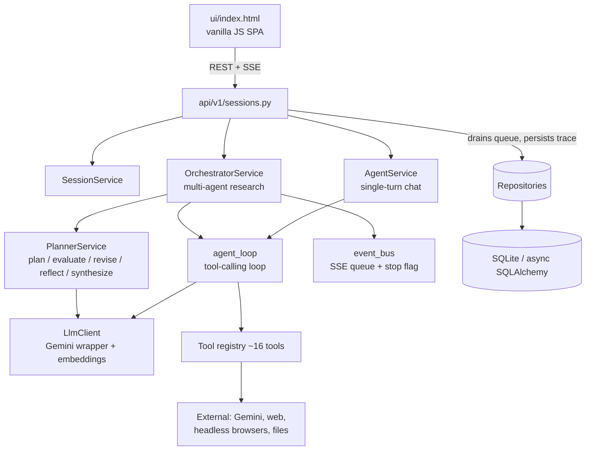

<div align="center">

# 🧠 Omni-Agent

**An agentic research harness — a Claude-Code-style backend that answers hard questions by _planning, running tools, and self-correcting in a loop_ instead of replying in a single shot.**

[](https://www.python.org/)
[](https://fastapi.tiangolo.com/)
[](https://ai.google.dev/)
[](https://www.sqlalchemy.org/)
[](https://docs.astral.sh/uv/)
[](https://docs.astral.sh/ruff/)
[](https://mypy-lang.org/)

</div>

---

Give it a question — optionally with uploaded files, folders, or images — and it
decomposes the work into a plan, executes the steps as **parallel sub-agents with
real tools** (web search, crawling, browser automation, document parsing,
cross-document retrieval, code/shell execution), then **evaluates, replans, and
reflects** until the answer is genuinely sufficient. Progress and the final
Markdown answer **stream live** to a minimal web UI with multi-session chat
history.

> _"Never take no for an answer."_ — the design principle: prefer trying another
> tool or approach over surfacing a refusal.

## 📑 Table of Contents

- [Highlights](#-highlights)
- [Features](#-features)
- [Tool Catalogue](#-tool-catalogue)
- [Architecture](#-architecture)
- [Quick Start](#-quick-start)
- [Configuration](#-configuration)
- [Project Structure](#-project-structure)
- [Development](#-development)
- [Docker](#-docker)
- [Documentation](#-documentation)
- [License](#-license)

## ✨ Highlights

- 🧩 **Multi-agent planning** — a NetworkX DAG of steps run as parallel sub-agents, with dynamic replanning mid-run.
- 🔁 **Self-correcting loop** — evaluator reshapes the plan; sub-agents critique their own results and gather more.
- 🌱 **Recursive fan-out** — any agent can split its task into more parallel child agents at run time.
- 🔎 **RAG-grade retrieval** — hybrid embeddings + BM25 + Reciprocal Rank Fusion + rerank, across your whole document corpus.
- 🛠️ **~16 real tools** — from Google-grounded search to headless-browser automation to a Python/Bash sandbox.
- 📡 **Live streaming** — plan, tool activity, reflections, and the answer stream over SSE; runs can be stopped and revised.
- 🌍 **Locale-aware** — resolves the visitor's country to localize sources, units, language, and the scraping browser's fingerprint.
- 💰 **Cost-aware & robust** — token ledger, per-session budgets, timeouts, circuit breakers, caching, and context compaction.

## 🚀 Features

<details open>
<summary><b>Research engine</b></summary>

- **Multi-agent research** — the planner decomposes the question; the orchestrator runs ready DAG nodes as parallel sub-agents; the evaluator reshapes the plan (add / drop / reorder / insert steps); the answer is synthesized and streamed.
- **Dynamic plan reshaping** — the evaluator can append steps, drop pending ones, and inject dependency edges to reorder or insert a prerequisite mid-run, without deadlocking the DAG.
- **Recursive sub-agent fan-out** — the `spawn_subagents` tool splits a task into N independent child agents (each with the full tool set), bounded by configurable depth / fan-out.
- **Sub-agent self-reflection** — after each pass a sub-agent critiques its own result ("sufficient, or gather more?") and loops until sufficient or capped.
- **Source-chasing extraction** — when a source only *points* to another document, the agent follows the reference (crawl → link map → download → raw-HTML inspection → browser interaction) instead of stopping at the pointer.

</details>

<details open>
<summary><b>Retrieval & knowledge (RAG)</b></summary>

- **Hybrid cross-document retrieval** — `corpus_search` searches **every** uploaded document and image at once, fusing **dense embeddings** (semantic) and **sparse BM25** (lexical) via **Reciprocal Rank Fusion**, then **LLM-reranks** the candidates — the shape used by OpenAI file_search / Vertex AI RAG Engine.
- **Structure-aware chunking** — chunks respect heading boundaries and carry a breadcrumb, so every retrieved passage says *where* it came from.
- **Embedding cache** — chunk embeddings are cached on disk per source artifact (keyed by model + chunk params), so follow-up questions and later turns never re-embed.
- **Single-document retrieval** — `bm25_search` (lexical) and `doc_navigate` (PageIndex reasoning over a section tree) for pinpoint work in one file.
- **File, folder & image Q&A** — upload individual files **or an entire folder** (only supported types are ingested, structure preserved); images are auto-described via Gemini vision and folded into the searchable corpus.

</details>

<details open>
<summary><b>Interaction & UI</b></summary>

- **Single-page web UI** (vanilla JS) — ask questions, attach files/folders, watch the plan and activity stream, render Markdown + Mermaid.
- **Streaming + stop + revise** — SSE streams plan/tool/reflection/answer events; a run can be stopped mid-flight and revised with a new instruction, reusing prior results.
- **Multi-session continuity** — prior conversation and artifacts feed into new turns; each query is a new "turn" with its own plan scoped by turn number.
- **Right-panel tabs** — **Plan** (per-turn step groups), **Activity** (full trace), and **Files** (session artifacts as a tree, downloadable).
- **Export** — download a chat as clean Markdown, or a full export with per-turn plan steps + activity trace.

</details>

<details open>
<summary><b>Robustness & operations</b></summary>

- **Per-model context & thinking selection** — choose model + thinking level (low/medium/high) per session from a central catalogue that drives context windows and output caps.
- **Live "now"** — every model turn is stamped with the current date/time (and, optionally, the user's country) so reasoning about recency and "latest" beats the training cutoff.
- **Country / locale context** — resolves the visitor's country (browser-detected or configured) to localize sources, units, language, and pin the scraping browser's locale, timezone, geolocation, and `Accept-Language`.
- **Dynamic robustness** — per-tool timeouts, a per-session circuit breaker for flaky tools, an in-session result cache, a no-progress guard, and refusal detection.
- **Context management** — large excerpts fed generously against the 1M-token window; the tool loop is compacted (summarized) once it crosses a model-derived threshold.
- **Cost accounting** — every LLM call is written to a token ledger; per-session input/output totals are tracked and shown, with an optional per-session budget cap and per-run wall-clock timing.
- **Persistent activity trace** — every meaningful event is persisted, so a session replays its full trace on reopen and in exports.

</details>

## 🧰 Tool Catalogue

Agents call tools via manual function-calling. Each tool declares a JSON schema,
a timeout, and whether it's "breakable" (subject to circuit-breaking).

| Tool | Category | What it does |
| --- | --- | --- |
| `web_search` | 🌐 Web | DuckDuckGo search (region-configurable, retries transient backends). |
| `gemini_search` | 🌐 Web | Fast factual answer grounded in Google Search, with source URLs. |
| `crawl_url` | 🌐 Web | Headless-browser fetch → clean Markdown **+** a structured link map **+** a raw-HTML artifact. |
| `discover_sitemap` | 🌐 Web | Enumerate a site's page URLs from robots.txt + sitemaps (recursive, httpx-only). |
| `browser_use` | 🌐 Web | Prompt-driven browser automation for JS-heavy / interactive pages. |
| `download_file` | 📥 Files | Fetch a remote file into the session as an artifact. |
| `parse_document` | 📄 Docs | Convert PDF/DOCX/XLSX/PPTX/HTML/… to Markdown (MarkItDown). |
| `read_artifact` | 📄 Docs | Read a chunk of parsed Markdown or a raw text artifact by offset. |
| `bm25_search` | 🔎 Retrieval | Lexical BM25 search **within one** parsed document. |
| `doc_navigate` | 🔎 Retrieval | PageIndex: reason over a document's section tree to pull the right section. |
| `corpus_search` | 🔎 Retrieval | **Hybrid embeddings + BM25 + RRF + rerank across ALL documents.** |
| `analyze_image` | 👁️ Vision | Ask a question about an uploaded/downloaded image. |
| `python_exec` | 💻 Sandbox | Run Python for computation / data wrangling. |
| `bash_exec` | 💻 Sandbox | Run shell commands. |
| `deep_think` | 🧠 Reasoning | Pure-reasoning step (no I/O): analysis → options → recommendation → next steps. |
| `spawn_subagents` | 🌱 Orchestration | Fan a task out into N parallel child agents with the full tool set. |

## 🏗️ Architecture

Layered FastAPI service. Routes parse input and call services; services own
business logic and call repositories; repositories own all DB access.



**Stack:** Python 3.14 (via `uv`) · FastAPI + Uvicorn · async SQLAlchemy 2.x
(SQLite by default, Postgres-capable) · Google Gemini (`google-genai`) ·
NetworkX (plan DAG) · MarkItDown, crawl4ai, browser-use, ddgs, rank-bm25, NumPy.

## ⚡ Quick Start

### Prerequisites

Install [`uv`](https://docs.astral.sh/uv/getting-started/installation/):

```bash
curl -LsSf https://astral.sh/uv/install.sh | sh
```

### Setup

```bash
# 1. Create the environment with the pinned Python version
uv venv --python 3.14.2

# 2. Install dependencies
uv pip install -r requirements.txt

# 3. Configure — copy the sample and set your Gemini key
cp .env.sample .env
# edit .env → set GEMINI_API_KEY=...
```

> `GEMINI_API_KEY` is the **only required** value; everything else has a sensible
> default (see [`app/core/config.py`](app/core/config.py)).

### Run

```bash
uv run uvicorn main:app --reload
```

- **🖥️ Web UI** — open <http://127.0.0.1:8000/ui/> — ask a question, attach files or a folder, watch the plan/activity stream, and export a chat as Markdown.
- **❤️ Health check** — <http://127.0.0.1:8000/health>

> `uv run` executes inside the project environment automatically — no manual
> activation needed.

## ⚙️ Configuration

All knobs live in [`.env`](.env.sample) (loaded by `app/core/config.py`). The
ones most worth knowing:

| Setting | Default | Purpose |
| --- | --- | --- |
| `GEMINI_API_KEY` | — | **Required.** Google Gemini API key. |
| `GEMINI_MODEL` | `gemini-3.1-flash-lite` | Default chat/reasoning model (per-session override in the UI). |
| `EMBEDDING_MODEL` | `gemini-embedding-001` | Embedding model for `corpus_search`. |
| `EMBEDDING_DIMENSIONS` | `768` | Embedding vector size (Matryoshka truncation). |
| `CORPUS_TOP_K` | `8` | Passages `corpus_search` returns per query. |
| `CORPUS_RERANK` | `true` | LLM-rerank fused candidates for precision. |
| `MAX_AGENT_ITERATIONS` | `120` | Max tool-loop turns for single-agent chat. |
| `MAX_PLAN_ITERATIONS` | `60` | Max plan→execute→evaluate replans per research run. |
| `SUBAGENT_MAX_ITERATIONS` | `60` | Max tool-loop turns per sub-agent. |
| `MAX_PLAN_NODES` | `48` | Hard cap on plan-graph nodes (runaway guard). |
| `SUBAGENT_MAX_REFLECTIONS` | `2` | Self-critique rounds per sub-agent. |
| `SESSION_TOKEN_BUDGET` | `0` | Per-session token cap (`0` = unlimited). |
| `USER_COUNTRY` | — | Fallback locale context (ISO-2 code or name); UI overrides per request. |

> **Unlimited iterations:** the iteration caps accept `0` (or any non-positive
> value) to mean **no limit** — the loop then runs until the model answers, the
> run is stopped, the token budget is hit, or the no-progress guard trips. Pair
> this with a token budget, since the iteration cap is otherwise the main
> runaway guard.

## 📂 Project Structure

```
main.py              # entrypoint: create_app() factory + uvicorn runner
app/
├── api/v1/          # HTTP routers (sessions, health) + aggregator
├── core/            # config, model catalogue, logging, exceptions, request context
├── db/              # async engine / session / Base + lightweight migrations
├── models/          # SQLAlchemy ORM models
├── repositories/    # all DB access & ORM queries
├── schemas/         # Pydantic DTOs (some double as Gemini structured-output schemas)
├── services/        # planner, orchestrator, agent loop, LLM client, event bus, use-cases
├── tools/           # agent tools + registry (search, crawl, retrieval, exec, browser, …)
└── retrieval/       # PageIndex section tree + chunking + hybrid RRF ranking
utils/               # pure helpers (response envelope, geo/locale, …)
tests/               # pytest + httpx (offline, fake LLM via dependency_overrides)
ui/                  # single-file vanilla-JS SPA
docs/                # design docs (idea, implementation plan)
```

> `app/` uses **namespace packages** (no `__init__.py`) — run mypy with
> `--explicit-package-bases`.

## 🧪 Development

```bash
uv run pytest -v                                    # tests (offline, no API key needed)
uv run ruff check .                                 # lint
uv run mypy --explicit-package-bases .              # type-check
uv run pre-commit install                           # enable git hooks (ruff + mypy)
```

Contributions follow the [Backend Engineering Guide](.github/copilot-instructions.md)
(KISS / YAGNI / DRY / SoC / SOLID, strict layering, full type annotations).

## 🐳 Docker

```bash
docker compose up --build
```

The image uses the `python:3.14.2-slim` base and installs dependencies with `uv`.

> **Production:** replace `--reload` with a production-ready configuration and set
> `ENV=production`, `DEBUG=False`. SQLite is the default store; the database URL
> is configurable (Postgres-capable).

## 📚 Documentation

- [**`.github/REPO_MAP.md`**](.github/REPO_MAP.md) — architecture, component responsibilities, feature map, and important concepts.
- [**`.github/copilot-instructions.md`**](.github/copilot-instructions.md) — the engineering guide governing all AI-assisted and human contributions.
- [**`docs/`**](docs/) — the original brief (`idea.md`) and the phased implementation plan.

## 📄 License

No license has been declared yet. Until a `LICENSE` file is added, all rights are
reserved by the authors — add one (e.g. MIT / Apache-2.0) to make reuse terms
explicit.
